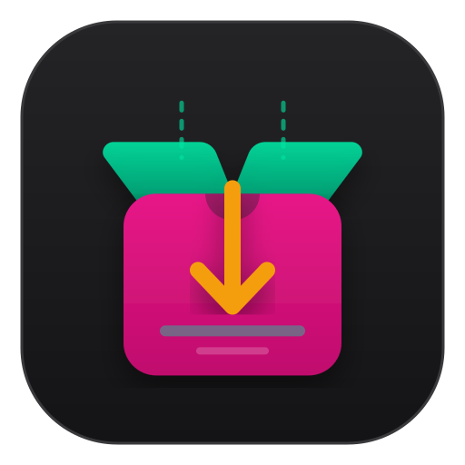

<p align="center">
  
</p>

<h1 align="center">NZBoxer</h1>

<p align="center">
  <strong>Lightweight, autonomous service connecting Simkl, TMDB, Newznab indexers, and TorBox.</strong>
</p>

<p align="center">
  
  
  
</p>

---

NZBoxer is a lightweight, autonomous service that connects Simkl, TMDB, Newznab indexers, and TorBox to completely automate the search, scoring, and downloading of your favorite movies and TV shows.

## Features

- **Automated Sync**: Seamlessly syncs your "Plan to Watch" lists from Simkl for Movies and Shows.
- **Smart Orchestration**: Leverages TMDB for exact digital release dates to know exactly when to start searching.
- **Configurable Scoring Engine**: Uses a highly customizable scoring matrix (configurable via UI) to evaluate NZB releases based on resolution, codecs, release groups, and bitrate.
- **Upgrade Logic**: Continuously monitors for better releases and upgrades existing downloads if they exceed your configured threshold.
- **Modern UI**: A lightweight, fast HTMX & TailwindCSS dashboard for monitoring status and managing season tracking.
- **Zero Dependencies (Almost)**: Uses SQLite with WAL-mode for high concurrency, meaning no heavy database setups (like PostgreSQL) are required.
- **Respectful & Rate-Limited**: Built-in intelligent rate-limiters ensure you never hammer upstream APIs (Simkl, TMDB, Newznab, TorBox) and includes daily grab limits to protect your indexer quotas.
- **Secure by Default**: The Docker container runs strictly as an unprivileged non-root user (UID 1000) for maximum security.

## Prerequisites

- Python 3.10+
- Accounts / API Keys for:
  - [Simkl](https://simkl.com/)
  - [TMDB](https://www.themoviedb.org/)
  - Newznab-compatible Indexer (e.g., Treasure Maps)
  - [TorBox](https://torbox.app/)

### 1. Installation & Running (Docker Recommended)

The easiest and most robust way to run NZBoxer is using the pre-built Docker image from the GitHub Container Registry. You do not need to install Python or create virtual environments.

Simply clone the repository and start the container:

> [!IMPORTANT]
> Because NZBoxer runs securely as an unprivileged user (UID 1000), you **must** manually create the `config` directory on your host *before* starting the container. If you let Docker create it automatically, it will be owned by `root` and the container will crash with a permission error.

```bash
git clone https://github.com/Reimaris/NZBoxer.git
cd NZBoxer
mkdir config
docker compose up -d
```

### 2. Configuration

All configuration (API Keys, Scoring, Notification Channels) is done directly via the Web UI in the Settings tab. There are no configuration files to manually edit.

### 3. Access the Dashboard

Access the dashboard at: [http://localhost:8000/](http://localhost:8000/) and navigate to the **Einstellungen** tab to configure your API keys and scoring preferences.

### Alternative: Local Python Environment

If you prefer to run it locally without Docker:

```bash
git clone https://github.com/Reimaris/NZBoxer.git
cd NZBoxer
python3 -m venv .venv
source .venv/bin/activate
pip install -r requirements.txt
uvicorn app.main:app --host 0.0.0.0 --port 8000
```

## Development & Testing

To run the test suite, MyPy type checker, and Ruff linter:

```bash
# Run tests
pytest -v

# Run type checking
mypy app/

# Run linter
ruff check app/ tests/
```

## Architecture

NZBoxer is built with:
- **FastAPI** for the web server and API
- **SQLAlchemy 2.0 (async)** for database operations
- **APScheduler** for background automation tasks
- **HTMX + Jinja2 + TailwindCSS** for the frontend
- **GuessIt** for parsing release names

See the `/docs/agent_memory/` directory for detailed architecture decisions and the project structure.
